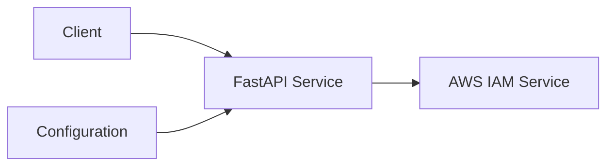

# AWS IAM Access Key 모니터링 시스템 MVP 설계

## 요약 및 실무 설계 포인트

- **실시간성과 대량 데이터 처리를 모두 지원하는 이중 엔드포인트 구조로 설계**
- **AWS Rate Limit, Credential Report 특성, 환경변수 기반 보안 등 실무적 요구사항을 반영**
- **비동기 FastAPI, aioboto3, uv 패키지 등 최신 Python 생태계 활용**

## 1. 시스템 개요

본 시스템은 AWS IAM 사용자의 Access Key Pair 생성 시간을 모니터링하여, 특정 시간(N시간) 이상 사용된 키 정보를 제공하는 API 서비스입니다.

## 2. 기술 스택

- **언어**: Python 3.10+
- **패키지 관리**: uv
- **웹 프레임워크**: FastAPI
- **AWS SDK**: aioboto3 (비동기)
- **컨테이너화**: Docker
- **오케스트레이션**: Kubernetes (Minikube)

## 3. 시스템 아키텍처



## 4. 주요 컴포넌트

### 4.1 API 서버

- FastAPI 기반 RESTful API 서버
- 엔드포인트:
  - `GET /v1/iam/old-access-keys/list-users` (실시간 AWS API 기반)
  - `POST /v1/iam/old-access-keys/credential-report` (Credential Report 기반)
- 매개변수:
  - `hours`: Body 파라미터 (N시간)
  - 환경 변수를 통한 AWS 인증 정보 설정

### 4.2 AWS IAM 인터페이스

- aioboto3 세션을 서비스 클래스에서 **싱글톤(1회 생성, 재사용)**으로 통합 관리
- **비동기 락(asyncio.Lock)**을 활용해 멀티코어 환경에서도 중복 생성 방지
- **세마포어(asyncio.Semaphore)**로 IAM API 동시 호출 개수 제한(기본 5)
- 서비스 종료 `shutdown` 시 `await iam_service.close()`로 자원 해제 명시
- Access Key 생성 시간 조회 및 필터링 로직
- Credential Report 기반 대량 Access Key 조회 기능 (Rate Limit 걱정 없음)
- 유저별 액세스 키 조회는 **asyncio.gather**로 병렬 처리

### 4.3 설정 관리

- 환경 변수 기반 설정 (pydantic + dotenv)
  - AWS 인증 정보
  - 애플리케이션 설정
  - uv 패키지로 의존성 관리

## 5. API 명세

### 5.1 실시간 AWS API 기반 엔드포인트

#### GET /v1/iam/old-access-keys/list-users

- **설명**: N시간 이상 된 Access Key 정보 조회 (실시간, 비동기)
- **Request (Query/Body)**:
  - `hours`: int (필수)
- **Response**:

```json
{
  "old_access_keys": [
    {
      "user_name": "string",
      "access_key_id": "string",
      "created_date": "datetime"
    }
  ]
}
```

### 5.2 Credential Report 기반 엔드포인트

#### POST /v1/iam/old-access-keys/credential-report

- **설명**: Credential Report 기반 N시간 이상된 Access Key 정보 조회 (대량 데이터, 최신성 100% 아님)
- **Request (Body)**:
  - `hours`: int (필수)
- **Response**:

```json
{
  "old_access_keys": [
    {
      "user_name": "string",
      "access_key_id": "string",
      "created_date": "datetime"
    }
  ]
}
```

#### 주요 서비스 클래스 사용 예시

```python
from backend.services.iam.service import IAMService

iam_service = IAMService()
old_keys = await iam_service.get_old_access_keys_from_list_users(hours=24)
# ...
await iam_service.close()  # 서비스 종료 시 반드시 호출
```

## 6. 구현 계획

### 6.1 백엔드 구현

1. FastAPI 기반 비동기 API 서버 구현
2. aioboto3를 활용한 AWS IAM **비동기 + 싱글톤** 연동
3. **동시성 제어(세마포어), 병렬 처리(asyncio.gather)** 적용
4. 타임아웃, 예외 처리, 입력 검증 등 견고한 서비스 구현

### 6.2 인프라 구현

1. Dockerfile 작성
2. Kubernetes 매니페스트 작성
   - Deployment
   - Service
   - ConfigMap/Secret
3. Minikube 환경 설정

## 7. 프로젝트 구조 (실제 구현 기준)

```
backend/
├── __main__.py
├── settings.py
├── logging.py
├── services/
│   └── iam/
│       ├── service.py
│       └── dependency.py
├── web/
│   ├── application.py
│   └── api/
│       └── iam/
│           ├── views.py
│           └── schema.py
└── ...
```

## 8. 보안 고려사항

1. AWS 인증 정보 보호
   - Kubernetes Secret 사용
   - 환경 변수를 통한 안전한 전달 (pydantic + dotenv)

## 9. 모니터링 및 로깅

1. 애플리케이션 로깅
   - 구조화된 JSON 로그 형식 (loguru 등)
   - 로그 레벨 설정
2. IAMService의 동시성/자원 관리 상태 모니터링(선택)

---

비동기 처리, **싱글톤 클라이언트/락/세마포어/병렬 처리**와 AWS Credential Report 활용을 통해, 대량의 사용자와 Access Key를 효율적으로 처리할 수 있는 구조를 갖추는 것이 본 시스템의 핵심입니다.

## AWS API 페이지네이션 및 Credential Report 처리 설계

### 1. 목적

- AWS IAM의 `list_users`, `list_access_keys` 등은 한 번에 모든 데이터를 반환하지 않고, 내부적으로 페이지네이션(`Marker`, `MaxItems`)을 지원합니다.
- 대량의 사용자가 존재할 때, 모든 유저/키 정보를 효율적으로 수집하기 위해 **AWS API의 페이지네이션을 어플리케이션 내부에서 구현**해야 합니다.
- Credential Report는 단일 호출로 대량의 Access Key 정보를 효율적으로 수집할 수 있습니다.

### 2. 구현 방식

- 실시간 API: aioboto3의 `get_paginator`를 사용하여 모든 페이지를 자동으로 순회
- Credential Report: CSV 파싱 및 반복문 기반 필터링
- 두 방식 모두 비동기 처리로 대량 데이터 환경에 적합

#### 예시 코드 (aioboto3)

```python
async def get_old_access_keys_from_list_users(hours: int):
    async with aioboto3.Session(...).client("iam") as client:
        paginator = client.get_paginator("list_users")
        users = []
        async for page in paginator.paginate():
            users.extend(page["Users"])
        # ... 이하 생략
```

---

- Credential Report 기반 엔드포인트와 실시간 API 기반 엔드포인트를 분리 제공
- 서비스 클래스에서 aioboto3 세션을 인스턴스 변수로 통합 관리
- 환경 변수 기반 설정 및 uv 패키지로 의존성 관리
- 실제 구현 구조와 일치하도록 문서 최신화
